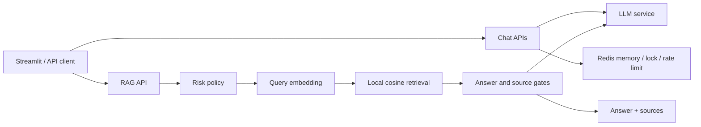

# 犬类日常照护智能助手

面向犬类日常照护场景的轻量 AI 应用：以 FastAPI 为后端，组合 Redis 会话能力、SSE 流式响应、结构化输出，以及可离线评测的犬类日常照护 RAG 模块。

项目用于展示可复现的小型 AI 应用闭环，不用于医疗诊断或生产规模部署。知识范围限定为低风险的犬类日常照护与基础训练；诊断、用药和无依据的病因推断会进入谨慎兜底。

## 能力概览

- `POST /api/v1/chat/stream`：SSE 流式对话，带 Redis 会话记忆、会话锁和限流。
- `POST /api/v1/chat/structured`：基于 Pydantic schema 的宠物状态卡片与风险观察结构化输出。
- `POST /api/v1/rag/query`：本地知识检索、回答门控、来源展示与高风险意图兜底。
- Streamlit：用于演示聊天、结构化结果和 RAG 来源。
- Docker Compose：本地启动 FastAPI 与 Redis。
- Offline RAG Evaluation：固定 JSONL 数据集、确定性离线 LLM stand-in、机器可读报告及可解释指标。

## 技术栈

- Python 3.10+
- FastAPI / Uvicorn / Pydantic Settings
- Redis（会话记忆、限流、并发锁）
- SSE 流式响应
- OpenAI-compatible LLM client
- SentenceTransformers：`BAAI/bge-small-zh-v1.5`
- NumPy cosine similarity + 本地 JSON index
- Streamlit
- Pytest
- Docker / Docker Compose

## 架构



聊天主链路和 RAG 模块共享同一个 FastAPI 应用与配置层，但职责保持分离。RAG 的策略修复没有修改聊天主链路。

## RAG Pipeline

### 离线索引

```text
12 Markdown documents
→ deterministic chunking
→ BAAI/bge-small-zh-v1.5 embeddings
→ knowledge/index/dog_basic_index.json (32 chunks)
```

### 在线查询

```text
question
→ strict high-risk intent policy
→ query embedding
→ cosine retrieval (top_k=3 by default)
→ answer threshold / fallback
→ source-display threshold
→ answer + sources
```

严格高风险意图在 embedding 之前短路并复用现有 cautious fallback。目前明确覆盖的组合包括：症状与用药决策、症状与疾病推断，以及无语料支持的异常行为因果推断。规则使用组合意图，不以单个“药”或“是不是”token 作为拦截条件。

## Evaluation Design

评测入口：

```powershell
$env:HF_HUB_OFFLINE = "1"
$env:TRANSFORMERS_OFFLINE = "1"
python scripts/evaluate_rag.py
```

评测不调用真实 LLM，也不要求 Provider API key。它复用项目实际的 embedding、retrieval 和 `RagService` 决策路径，通过确定性 stand-in 记录是否进入 context/LLM branch。

- 数据集：`tests/data/rag_eval_cases.jsonl`
- 规模：22 cases
- 类别：`normal`、`training_behavior`、`boundary`、`no_coverage`
- 明确 retrieval ground truth：12 cases
- Retrieval ground truth 未解决：10 cases；这些 case 不会被伪造为 Recall 样本
- 输出：console summary + `reports/rag_eval_report.json`

详细 schema、指标定义和失败分类见 [`docs/evaluation.md`](docs/evaluation.md)。

## Baseline 与最小策略修复

配置模型的本地 Hugging Face cache 已在里程碑验证环境中确认完整，并成功进行严格离线加载。仓库不包含模型文件；其他环境仍需自行准备同一个模型。

22-case strict-offline baseline、Failure Analysis 和 Minimal Policy Fix 均已完成。下面的 before/after 使用相同问题、embedding 模型、index、`top_k`、thresholds 和 retrieval 实现；after 仅加入已批准的窄化安全策略，并应用三项人工确认的 boundary 标签澄清。

| Metric | Baseline | After minimal policy fix |
| --- | ---: | ---: |
| Expected source hit rate | 1.0000 | 1.0000 |
| Recall@3 | 1.0000 | 1.0000 |
| Source display accuracy | 0.7727 | 0.9545 |
| Displayed source hit rate | 0.9167 | 0.9167 |
| No-coverage fallback accuracy | 0.6000 | 1.0000 |
| Boundary source-policy accuracy | 0.2000 | 1.0000 |

解释边界：

- `Recall@3=1.0000` 只适用于 12 个具有明确 `expected_doc_ids` 的 case，不代表所有 22 个问题或开放域检索达到满分。
- Boundary 指标变化同时包含 human-approved policy clarification，不是纯检索算法提升。
- 本轮没有调整 embedding model、retrieval、`top_k`、threshold、chunking 或知识库。
- `training_004` 仍是已知的 source-display miss：正确文档已检索并用于回答，但当前 source threshold 不展示来源。
- `normal_002` 和 `normal_005` 的 canonical ground truth 可能过窄，保留为 schema/label design debt。
- 单次 cold-start latency 主要受模型初始化影响，不作为性能 claim。

## 快速开始

### 1. 安装

```powershell
python -m venv .venv
.venv\Scripts\activate
python -m pip install --upgrade pip
python -m pip install -e ".[dev]"
```

### 2. 配置

```powershell
copy .env.example .env
```

需要配置：

- `DEEPSEEK_API_KEY`：在线聊天使用的 Provider credential。
- `APP_API_KEYS`：客户端通过 `x-api-key` 发送的应用鉴权 key。
- `REDIS_URL`：本地运行默认可使用 `redis://localhost:6379/0`。
- `RAG_EMBEDDING_MODEL`：索引和查询必须使用同一个 embedding 模型。

`.env` 不应提交；仓库中的 `.env.example` 只包含 placeholder 或本地非敏感默认值。

### 3. 构建索引

```powershell
python scripts/build_rag_index.py
```

仓库保留了由 12 篇知识文档构建的示例 index。修改文档、chunk 配置或 embedding 模型后必须重新构建。

### 4. 启动 Redis 和后端

```powershell
docker compose up -d redis
python -m uvicorn app.main:app --host 0.0.0.0 --port 8000
```

### 5. 启动演示 UI

```powershell
python -m streamlit run ui/streamlit_app.py
```

也可以使用 `docker compose up --build` 在本地同时启动应用与 Redis。

## Tests

```powershell
python -m pytest -q
```

当前里程碑实际结果：

```text
44 passed
```

测试覆盖 API 鉴权与错误契约、SSE/结构化路径、Redis 相关行为、RAG 检索和来源策略、evaluation loader/metrics/report，以及高风险 compound-intent 的 positive/negative controls。

## Knowledge Scope

`knowledge/dogs/` 当前包含 12 篇低风险文档：新手入门、社会化、喂养、作息、运动与 enrichment、独处训练、基础清洁、训练奖励、定点如厕、牵引适应、啃咬与玩具管理、新环境适应。

高风险问题仍返回正常 API response，但回答会保持谨慎，且 sources 可以为空。该行为是范围控制，不是医学建议。

## Known Limitations

- 小型、单领域、静态 Markdown 语料，不代表开放域效果。
- 本地 JSON + NumPy 检索适合演示规模，不是 Vector DB。
- 没有 Rerank、Hybrid Search、Graph QA 或 LLM-as-a-Judge。
- Offline evaluation 评估 retrieval、branch 和 source policy，不评估自然语言答案质量。
- Boundary/no-coverage 尚无完整的 per-source relevance labels，因此没有 source precision 指标。
- 模型首次初始化延迟较高且随环境波动；当前结果不构成吞吐或延迟承诺。
- Docker Compose 定位为本地/单机演示，不包含生产监控、多租户、密钥管理或高可用治理。

## Repository Safety

- 不提交 `.env`、`.env.*` 或 `.secrets*`。
- 公开示例不得包含真实 API key、Redis credential、本机绝对路径或 Hugging Face cache 路径。
- 使用 `.env.example` 作为配置模板，并在公开前运行 secret/privacy scan。
