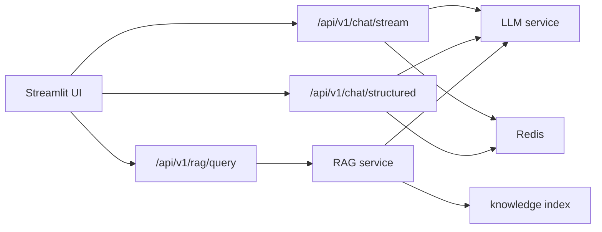
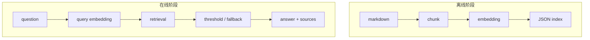

# 面向犬类日常照护的智能助手系统 

一个基于 `FastAPI + Redis + Streamlit` 的 AI 应用后端底座示例项目。

当前项目分成两部分：
- A：流式宠物对话 + Redis 会话记忆 + 结构化输出
- B：面向狗狗日常照护场景的最小 RAG 知识问答模块

项目目标是做出一个可复现、可演示、可解释、带基本部署意识的小型完整作品，而不是医疗系统、生产级平台或复杂多智能体框架。

## 项目简介

A 最初从单文件的流式聊天 demo 演进而来，当前已经整理成分层 FastAPI 工程；B 在这个底座上增加了一个最小 RAG 闭环，用于演示“项目内知识文档 -> 检索 -> 回答 + 来源”的完整链路。

当前版本强调三件事：
- 能跑通完整链路：后端、Redis、索引构建、前端演示
- 能讲清模块职责：A 负责对话与结构化能力，B 负责知识问答
- 能体现工程意识：配置外置、接口固定、README 可复现、支持本地服务化运行

## A 和 B 的关系

- A 是底座：提供 FastAPI 应用、Redis 连接、鉴权、限流、会话锁、LLM 调用、Streamlit 演示前端。
- B 是增量模块：在不改 A 主链路契约的前提下，增加 `POST /api/v1/rag/query` 和知识索引构建脚本。
- A 和 B 共用同一个后端进程、同一套配置管理、同一个 Streamlit 页面。
- A 的重点是“流式会话 + 结构化输出”；B 的重点是“最小 RAG 闭环 + 来源展示 + 高风险问题谨慎兜底”。

## 功能模块概览

### 模块一：宠物对话（拟人陪伴）
- 路径：`POST /api/v1/chat/stream`
- 形式：SSE 流式输出
- 特点：宠物拟人陪伴风格、Redis 会话记忆、适合演示实时流式回复

### 模块二：宠物今日状态卡片
- 路径：`POST /api/v1/chat/structured`
- `task_type=daily_card`
- 特点：固定 schema、适合展示结构化输出、聚焦宠物一天状态整理

### 模块三：行为观察与风险提示
- 路径：`POST /api/v1/chat/structured`
- `task_type=risk_analysis`
- 特点：主人视角的观察提示，语气尽量温和，不包装为正式诊断结论

### 模块四：宠物知识问答（狗狗照护）
- 路径：`POST /api/v1/rag/query`
- 特点：最小 RAG 闭环、返回 `answer + sources + request_id`
- 使用场景：狗狗低风险、日常照护与基础训练问题

## A + B 总体架构



## B 模块的 RAG 主链路说明

### B 的定位

B 不是通用 research 系统，也不是医疗知识库。它当前只做最小可运行的狗狗照护知识问答：
- 输入问题
- 检索项目内知识文档
- 组织回答
- 返回来源信息

### 离线阶段与在线阶段



### 在线请求的最小链路

1. `POST /api/v1/rag/query` 接收 `user_message` 和 `top_k`
2. 生成 query embedding
3. 在本地 JSON index 中做相似度检索
4. 根据阈值和问题类型决定：
   - 是否允许进入回答
   - 是否允许展示 `sources`
5. 返回：
   - 正常问答：`answer + sources + request_id`
   - 未覆盖或高风险问题：谨慎兜底回答，`sources` 可能为空列表


## **安装与验证说明补充**

当前 A+B 已在现有开发环境中完成实际联调验证，包括：

- RAG 索引构建
- FastAPI 后端启动
- Streamlit 前端调用
- pytest 测试通过

需要说明的是，python -m pip install -e .[dev] 的“冷启动安装验证”目前在这台机器上仍受到本机 Python 环境异常影响，主要表现为 Anaconda / TEMP / venv 相关问题。
这类问题更偏向环境层，不代表 A+B 的业务逻辑、接口链路或运行结果存在阻塞性故障。

本项目当前已补充显式 package discovery 配置，仅将 app/ 作为 Python package，避免 flat-layout 下多个顶层目录导致 editable install 自动发现失败。

如果后续需要补做更严格的冷启动安装验证，建议在**更干净的 Python 环境**中执行，例如：

- 官方 Python 新环境
- 干净的 Conda env
- 无历史 TEMP / venv 异常干扰的机器

建议验证链路如下：

```
python -m venv .venv .venv\Scripts\activate python -m pip install --upgrade pip python -m pip install -e .[dev] python scripts/build_rag_index.py python -m uvicorn app.main:app --host 0.0.0.0 --port 8000 python -m streamlit run ui/streamlit_app.py python -m pytest -q
```

## 

## 快速启动

### 1. 安装依赖

```powershell
python -m venv .venv
.venv\Scripts\activate
pip install -e .[dev]
```

### 2. 准备环境变量

```powershell
copy .env.example .env
```

至少需要确认这些项：
- `DEEPSEEK_API_KEY`
- `APP_API_KEYS`
- `REDIS_URL`

### 3. 构建 B 模块索引

```powershell
python scripts/build_rag_index.py
```

当前仓库保留了 `knowledge/index/dog_basic_index.json` 作为示例索引；如果你更新了知识文档或 embedding 配置，可以重新执行上面的命令进行重建。

### 4. 启动后端

```powershell
python -m uvicorn app.main:app --host 0.0.0.0 --port 8000
```

### 5. 启动 Streamlit

```powershell
python -m streamlit run ui/streamlit_app.py
```


## 本地服务化运行说明

如果你把它当作一个本地长期运行的小服务，而不是一次性 demo，可以按下面方式理解：
- Redis 单独常驻
- FastAPI 后端单独常驻
- Streamlit 作为演示或调试前端按需启动

最常见的本地运行组合是：
- Redis：本机 Memurai 或 Docker Redis
- 后端：`python -m uvicorn ...`
- 前端：`python -m streamlit run ...`

## Redis 与本地运行说明

你可以任选一种方式：

### 方式一：Windows 本地 Memurai
- 安装并启动 Memurai
- 常见地址：

```env
REDIS_URL=redis://localhost:6379/0
```

直接在本机运行 FastAPI / Streamlit 时，`REDIS_URL` 通常使用 `redis://localhost:6379/0`。

### 方式二：Docker 启 Redis

```powershell
docker run --name a-project-redis -p 6379:6379 -d redis:7-alpine
```

## 演示问题示例

推荐固定演示下面 4 个问题：

1. `幼犬什么时候适合开始做社会化训练？`
   - 展示：正常知识问答

2. `刚接回家的小狗前几天怎么安排作息比较稳妥？`
   - 展示：新增知识文档命中

3. `狗狗独处训练怎么开始比较稳妥？`
   - 展示：来源 `sources` 的紧凑展示

4. `狗狗发烧是什么问题？`
   - 展示：高风险问题谨慎兜底，`sources` 可能为空

## 推荐演示流程

1. 启动 Redis、后端、Streamlit
2. 在侧边栏填好 `base_url` 与 `x-api-key`
3. 先演示模块一的流式宠物对话
4. 换一个新的 `session_id`
5. 演示模块二的宠物今日状态卡片
6. 再换一个新的 `session_id`
7. 演示模块三的行为观察与风险提示
8. 最后演示模块四的 4 个固定问题
9. 展开调试区，展示 `request_id`、`tool_calls`、原始 JSON

之所以建议切换 `session_id`，是因为 A 当前对同一个 `session_id` 做了会话锁保护，连续并发点击时会返回 `SESSION_LOCKED`，这属于预期行为。

## 知识范围与高风险问题兜底说明

### 当前 B 模块知识范围

当前知识库只覆盖狗狗低风险、日常照护与基础训练主题：
- 新手养狗入门
- 幼犬训练与社会化
- 喂养与营养基础
- 作息与休息安排
- 日常运动与 enrichment
- 独处训练基础
- 基础清洁与梳理
- 零食与训练奖励使用原则

### 高风险问题的当前处理方式

如果问题明显带有下面这些特征，系统会更倾向谨慎兜底：
- 症状判断
- 原因推测
- “是不是缺什么”
- “是什么问题”
- “怎么处理”
- 其他接近诊断或处理建议的问题

这类情况下：
- 接口仍然可能正常返回 `200`
- `answer` 会保持谨慎风格
- `sources` 可能为空列表

这属于当前 v1.0 的设计取向，不是异常。

## 环境变量说明

见项目根目录下的 `.env.example`。

重点变量：
- `DEEPSEEK_API_KEY`：LLM Provider 密钥
- `APP_API_KEYS`：前端或客户端请求头使用的 `x-api-key`
- `REDIS_URL`：Redis 地址
- `DEFAULT_MODEL`：默认模型名
- `RAG_INDEX_PATH`：B 模块索引路径
- `RAG_EMBEDDING_MODEL`：构建和查询索引所用的 embedding 模型

## Docker 与最小部署说明

项目已经包含：
- `Dockerfile`
- `docker-compose.yml`

当前 Docker 路径定位是：
- 适合本地或单机演示
- 一次拉起 FastAPI 应用和 Redis
- 不等同于“已上线生产系统”

启动方式：

```powershell
copy .env.example .env
docker compose up --build
```

在 Docker Compose 场景里，`app` 容器内的 `REDIS_URL` 会由 compose 显式覆盖为 `redis://redis:6379/0`，因此不需要修改 `.env.example` 中的本地默认值。

如果你后续要迁移到服务器，最小思路就是：
- 准备 Redis
- 准备 `.env`
- 先在服务器上构建好 RAG 索引
- 再启动 FastAPI 服务和前端

当前项目没有继续往云原生、监控、日志聚合、多实例部署方向扩展，这部分属于后续工作。

## 常见问题排查

### 1. `SESSION_LOCKED` / HTTP 409

说明同一个 `session_id` 还有请求在处理中。

处理方式：
- 等当前请求完成
- 或换一个新的 `session_id`

### 2. `STRUCTURED_OUTPUT_INVALID`

说明模型返回的结构化内容没有通过 schema 校验。

处理方式：
- 重试一次
- 改写输入，让它更像“宠物观察描述”
- 换一个新的 `session_id`

### 3. `RAG_INDEX_NOT_READY`

说明 B 模块的索引还没准备好，或者索引文件为空、损坏、向量维度异常。

处理方式：
- 先运行 `python scripts/build_rag_index.py`
- 检查 `RAG_INDEX_PATH`
- 如果改过 embedding 模型，重新构建一次索引

这个错误只影响 B，不会影响 A 的模块一、二、三。

### 4. Streamlit 页面能打开，但接口报错

检查：
- 后端是否已经启动
- `x-api-key` 是否和 `.env` 中的 `APP_API_KEYS` 对应
- `DEEPSEEK_API_KEY` 是否有效

### 5. RAG 问题有回答，但没有 `sources`

这通常不是 bug，而是当前策略的结果：
- 问题可能超出知识范围
- 问题带有高风险判断倾向
- 检索命中不足以支撑把来源正式展示给用户

## 当前局限

- 当前是 AI 应用后端底座 + 最小 RAG 模块，不是生产级平台
- 知识库规模仍然很小，主题集中在狗狗低风险、日常照护场景
- B 模块目前只支持项目内 markdown 文档，不接入向量数据库
- 没有做多租户、监控、审计、后台任务调度、复杂部署治理
- 高风险问题目前只做谨慎兜底，不提供专业判断

## 后续扩展方向

- 扩充更系统的宠物知识文档
- 为 B 增加更清晰的索引管理与重建流程
- 继续完善 README、演示脚本和部署说明
- 在保持接口稳定的前提下，再评估是否引入更强的检索增强能力

## 其他运行方式

### 运行客户端样例

```powershell
python client/test_client.py
python client/test_rag_api.py
```

### 运行测试

```powershell
python -m pytest -q
```
